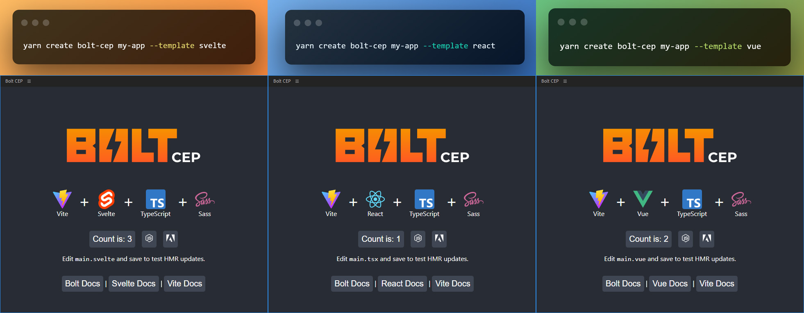

A lightning-fast boilerplate for building Adobe CEP Extensions in React, Vue, or Svelte built on Vite + TypeScript + Sass


[](https://github.com/hyperbrew/bolt-cep/blob/master/LICENSE)
[](https://discord.gg/PC3EvvuRbc)

## Features

- Lightning Fast Hot Module Replacement (HMR)
- Write Modern ES6 in both the JavaScript and ExtendScript layers
- Type-safe ExtendScript with Types-for-Adobe
- End-to-End Type Safety with evalTS()
- Easily configure in cep.config.ts
- Setup for single or multi-panel extensions
- Comes with multi-host-app configuration
- Optimized Build Size
- Easy Publish to ZXP for Distribution
- Easy Package to ZIP archive with sidecar assets
- GitHub Actions ready-to-go for ZXP Releases

_Full Blog Post:_ https://hyperbrew.co/blog/bolt-cep-build-extensions-faster/

### Dev Requirements

- [Node.js](https://nodejs.org/en) 16 or later
- [Yarn](https://yarnpkg.com/getting-started/install) 1.x.x aka classic (ensure by running `yarn set version classic`)

### Compatibility

- [Adobe CC Apps](https://www.adobe.com/creativecloud/desktop-app.html) version 2022 or later
- Windows & Mac Intel
- Mac Arm64 (M1 / M2) require special setup ([more details](#misc-troubleshooting))

---

## Backers

Huge thanks to our backers who have made this project possible!

<a href="https://battleaxe.co/" target="_blank">
</a>

If you're interested in supporting this open-source project, please [contact the Hyper Brew team](https://hyperbrew.co/contact/).

---

## Tools Built with Bolt CEP

Tools like Rubberhose 3, Klutz GPT, Brevity, and more are powered by Bolt CEP! Check out the full library of tools built with Bolt CEP:

[Built with Bolt CEP](https://hyperbrew.co/resources/bolt-cep/)


---

## Support

### Free Support 🙌

If you have questions with getting started using Bolt CEP, feel free to ask and discuss in our free Discord community [Discord Community](https://discord.gg/PC3EvvuRbc).

### Paid Priority Support 🥇

If your team is interested in paid consulting or development with Bolt CEP, please [contact the Hyper Brew team](https://hyperbrew.co/contact/). More info on our [Adobe Plugin Development & Consulting Services](https://hyperbrew.co/landings/boost-development)

---

## Can I use Bolt CEP in my free or commercial project?

Yes! Bolt CEP is **100% free and open source**, being released under the MIT license with no attribution required. This means you are free to use it in your free or commercial projects.

We would greatly appreciate it if you could provide a link back to this tool's info page in your product's site or about page:

Bolt CEP Info Page Link: https://hyperbrew.co/resources/bolt-cep

**Built with Bolt CEP** button graphics:

**PNG Files**

<div style="display:flex;gap:1rem;">
<a href="./src/js/assets/built-with-bolt-cep/Built_With_BOLT_CEP_Logo_White_V01.png" target="_blank">
</a>

<a href="./src/js/assets/built-with-bolt-cep/Built_With_BOLT_CEP_Logo_Black_V01.png" target="_blank">
</a>

</div>

**SVG Files**

<div style="display:flex;gap:1rem;">
<a href="src/js/assets/built-with-bolt-cep/Built_With_BOLT_CEP_Logo_White_V01.svg" target="_blank">
</a>

<a href="src/js/assets/built-with-bolt-cep/Built_With_BOLT_CEP_Logo_Black_V01.svg" target="_blank">
</a>
</div>

## Quick Start




`yarn create bolt-cep`

- Create Extension

`cd myApp`

- CD into Directory

`yarn`

- Installs all dependencies

`yarn build`

- Runs initial build
- Creates cep folder structure
- Creates symlink to extensions folder

`yarn dev`

- Runs in dev mode with HMR Hot-reloading.
- Both JS and ExtendScript folders re-build on changes
- Viewable in browser via localhost:3000/panel/
  - (e.g. http://localhost:3000/main/, http://localhost:3000/settings/, etc. (see [Panel Structure](#cep-panel-structure) to set up multiple panels)))

`yarn serve`

- Serve files after running `yarn build`
- Viewable in browser via localhost:5000/panel/
  - (e.g. http://localhost:5000/main/, http://localhost:5000/settings/, etc. (see [Panel Structure](#cep-panel-structure) to set up multiple panels)))

`yarn zxp`

- Builds and bundles your project into a zxp for publishing in the `dist/zxp` folder

`yarn zip`

- Bundles your zxp and specified assets to a zip archive in the `dist/zip` folder

---

## Config

Update your CEP build and package settings in `cep.config.ts` safely typed

Start building your app in `src/js/main/index(.tsx or .vue or .svelte)`

Write ExtendScript code in `src/jsx/main.ts`

---

## CEP Panel Structure

Each panel is treated as it's own page, with shared code for efficiency. The Boilerplate currently comes with 2 panels, `main` and `settings`. These are configured in the `cep.config.ts`.

Each panel can be edited in their respective folders:

```
src
 └─ js
    ├─ main
    │   ├─ index.html
    |   └─ index.tsx
    └─ settings
        ├─ index.html
        └─ index.tsx
```

To add panels, add an item to the panels object in `cep.config.ts`, and duplicate the folder structure and adjust as needed.

---

## ExtendScript

ExtendScript can be written in ES6 and will be compiled down to a single ES3 file for compatibility.

JSON 2 is included by default, and any external JS libraries added with the include directive will be bundled as well:

```js
// @include './lib/library.js'
```

App-specific code is split into modules for type-safe development by the application's name as seen in the `index.ts`.

```
aftereffects >> aeft/aeft.ts
illustrator >> ilst/ilst.ts
animate >> anim/anim.ts
```

Write your app-specific functions in each of these separate modules, and they will be required per each application.

To add support for additional host apps:

- Add additional app module files (aeft.ts, anim.ts, etc).
- Extend the main `switch()` in `scr/jsx/index.ts` with your additional.
- Add the host to your `cep.config.ts` file.

---

## Calling ExtendScript from CEP JavaScript

All ExtendScript function are appended to your panel's namespace in the background to avoid namespace clashes when using `evalTS()` and `evalES()`.

We have now introduced a new and improved end-to-end type-safe way to interact with ExtendScript from CEP using `evalTS()`. This function dynamically infers types from
ExtendScript functions and handles both stringifying and parsing of the results so your developer interaction can be as simple as possible.

As demonstrated in `main.tsx`, your ExtendScript functions can be called with `evalTS()` by passing the name of the function, followed by the arguments.

CEP

```js
evalTS("myFunc", "test").then((res) => {
  console.log(res);
});

evalTS("myFuncObj", { height: 90, width: 100 }).then((res) => {
  console.log(res.x);
  console.log(res.y);
});
```

ExtendScript

```js
export const myFunc = (str: string) => {
  return str;
};

export const myFuncObj = (obj: { height: number, width: number }) => {
  return {
    y: obj.height,
    x: obj.width,
  };
};
```

For any existing Bolt CEP projects, rest assured that the legacy `evalES()` function remains in place as usual as demonstrated in `main.tsx`.

```js
evalES(`helloWorld("${csi.getApplicationID()}")`);
```

You will also want to use this function for calling ExtendScript functions in the global scope directly, by passing `true` to the second parameter:

```js
evalES(
  `alert("Hello from ExtendScript :: " + app.appName + " " + app.version)`,
  true
);
```

---

## Calling CEP JavaScript from ExtendScript

For certain situations such as hooking into event listeners or sending updates during long functions, it makes sense to trigger events from the ExtendScript environment to the JavaScript environment. This can be done with `listenTS()` and `dispatchTS()`.

Using this method accounts for:

- Setting up a scoped listener on the JS side for the CSEvent
- Setting up PlugPlug CSEvent event on ExtendScript side
- Ensuring End-to-End Type-Safety for the event

### 1. Declare the Event Type in EventTS in shared/universals.ts

```js
export type EventTS = {
  myCustomEvent: {
    oneValue: string,
    anotherValue: number,
  },
  // [... other events]
};
```

### 2. Listen in CEP JavaScript

```js
import { listenTS } from "../lib/utils/bolt";

listenTS("myCustomEvent", (data) => {
  console.log("oneValue is", data.oneValue);
  console.log("anotherValue is", data.anotherValue);
});
```

### 3. Dispatch in ExtendScript

```js
import { dispatchTS } from "../utils/utils";

dispatchTS("myCustomEvent", { oneValue: "name", anotherValue: 20 });
```

Alternatively, `dispatchTS()` can also be used in the same way from the CEP side to trigger events within or between CEP panels, just ensure you're importing the dispatchTS() function from the correct file within the `js` folder.

```js
import { dispatchTS } from "../lib/utils/bolt";

dispatchTS("myCustomEvent", { oneValue: "name", anotherValue: 20 });
```

---

## GitHub Actions ZXP Releases

This repo comes with a configured GitHub Action workflow to build a ZXP and add to the releases each time a git tag is added.

```
git tag 1.0.0
git push origin --tags
```

Then your new build will be available under GitHub Releases.

---

---

## Copy Assets

If you have assets that you would like copied without being affected by the bundler, you can add the optional `copyAssets:[]` array inside your cep.config.ts to include files or entire folders.

```js
  copyAssets: ["public", "custom/my.jsx"],
```

**Example:**

Files placed in `src/public` will be copied to `dist/public` with config set to `copyAssets: ["public"]`.

---

---

## Copy Zip Assets

If you have assets that you would like copied with your zxp into a zip archive for delivery, you can add the optional `copyZipAssets:[]` array inside your cep.config.ts to include files or entire folders. A folder ending in "/\*" will copy the contents without the folder structure into the zip destination.

```js
  copyZipAssets: ["instructions/*", "icons"],
```

---

## Custom Ponyfills

Unlike Polyfills which modify the global prototype, Ponyfills replace functionality with custom methods. Built-in Ponyfills include:

- Object.freeze()
- Array.isArray()

You can add your own Ponyfils by passing them into the `jsxPonyfill()` function in `vite.es.config.ts`:

```js
jsxPonyfill([
  {
    find: "Array.isArray",
    replace: "__isArray",
    inject: `function __isArray(arr) { try { return arr instanceof Array; } catch (e) { return false; } };`,
  },
]);
```

If you have a common Ponyfill you feel should be built-in, create a ticket and we'll look into it.

---

## ExtendScript Scope

This boilerplate is flavored for a single JSX object attached to helper object `$` for all your panels to prevent pollution in the global namespace. If you prefer to include your own raw JSX, include it in the Copy Assets object (above), and add the optional scriptPath object to your cep.config.ts file.

```js
  panels: [
    {
      name: "main",
      scriptPath: "custom/index.jsx",
      [...]
    },
    {
      name: "settings",
      scriptPath: "custom/settings.jsx",
      [...]
    },
  ],
  copyAssets: ["custom"],
```

---

## Troubleshooting Modules

Node.js Built-in modules can be imported from the `src/js/lib/node.ts` file.

```js
import { os, path, fs } from "../lib/node";
```

To use 3rd party libraries, first attempt to use with the standard import syntax.

```js
import { FaBolt } from "react-icons/fa";
```

If the import syntax fails (typically with modules that use the Node.js runtime) you can resort to the Node.js `require()` syntax,

```js
const unzipper = require("unzipper");
```

The build system will detect any non-built-in Node.js modules using `require()` and copy them to the output `node_modules` folder, but if a package is missed, you can add it explicitly to the `installModules:[]` array inside your `cep.config.ts` file.

```js
  installModules: ["unzipper"],
```

Also if they're Node.js-specific modules, it's best to place the requires inside functions so they are only required at runtime and don't break your panel when previewing in the browser.

---

## A Note on Routers

If you would like to set up a routing system like react-router, be aware that you'll have to make adjustments for CEP. React Router for instance bases the router path off of `window.location.pathname` which in the browser resolves to the page:

`/main/index.html`

yet in CEP context resolves to the full system path:

`file:///C:/Users/Username/AppData/Roaming/Adobe/CEP/extensions/com.bolt.cep/main/index.html`

To solve this, you'll need to adjust the router basename for each context, here is one way of accomplishing that with the panel named `main`:

```js
const posix = (str: string) => str.replace(/\\/g, "/");

const cepBasename = window.cep_node
  ? `${posix(window.cep_node.global.__dirname)}/`
  : "/main/";

ReactDOM.render(
  <React.StrictMode>
    <Router basename={cepBasename}>[...]</Router>
  </React.StrictMode>,
  document.getElementById("root")
);
```

## Misc Troubleshooting

**ZXPSignCmd Permissions issues on Mac**:

If you're getting permissions errors running ZXPSignCmd on the latest Mac releases, try a fresh clone. If that does't work, reset permissions for ZXPSignCmd by opening the directory `node_modules/vite-cep-plugin/lib/bin` and running `chmod 700 ./ZXPSignCmd`.

**Build Issues on Mac Arm64 Apple Silicon Machines (M1/M2/M3)**

Full blog post on [Setup ExtendScript Dev for Apple Silicon Macs](https://hyperbrew.co/blog/setup-extendscript-dev-for-apple-silicon/)

Short summary:

If you're experiencing issues building on your Apple Silicon Machine regarding the jsxbin package, it is a known issue since the jsxbin package does not currently contain a binary for Apple Silicon since Adobe has yet to release one ([issue details here](https://github.com/runegan/jsxbin/issues/29)). To solve this issue, you can either:

- **A: Disable JSXBIN**
  - In the `cep.config.ts` set `jsxBin: "off"` in the build and zxp portions.
- **B: Run in x64 mode**
  - Ensure a universal binary version of Node.js is installed (available on [nodejs.org](https://nodejs.org/en/download))
  - Run your terminal in Rosetta mode, or additionally install the Intel build of VS Code.
  - Delete and re-install your node_modules folder if you've already built it.

**Update a Bolt CEP Project** To update an existing Bolt CEP project to the the latest version, create a new Bolt CEP project with the same framework (React, Vue, Svelte), then compare and update the following files:

1. `package.json` - Update all dependencies and scripts ( `vite-cep-plugin` - usually contains the most frequent updates )
2. `vite.config.ts` - Unless you've modified the vite config yourself, you can just copy the contents of the latest into yours.
3. `vite.es.config.ts` - Like the previous config, unless you've modified it yourself, you can just copy the contents of the latest into yours.
4. `cep.config.ts` - Check if any new properties have been added that don't exist in your config.
5. `src/js/lib` - Update this entire folder.
6. `src/jsx/index.ts` - Check if any new properties have been added that don't exist in your config.
7. `src/shared/universals.d.ts` - Check if any new properties have been added that don't exist in your config.
